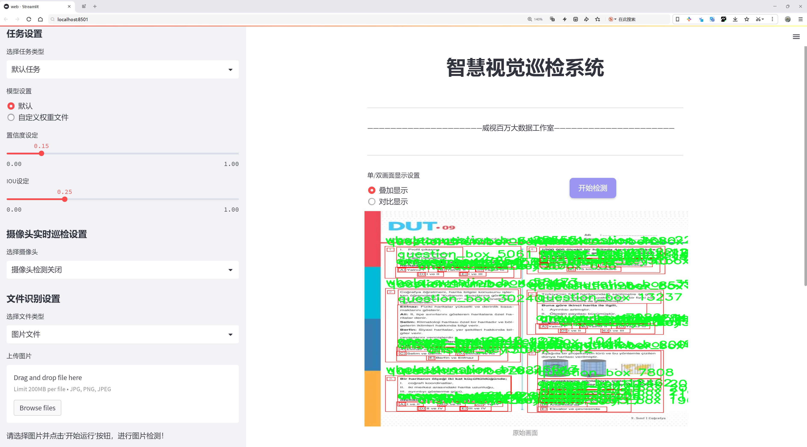
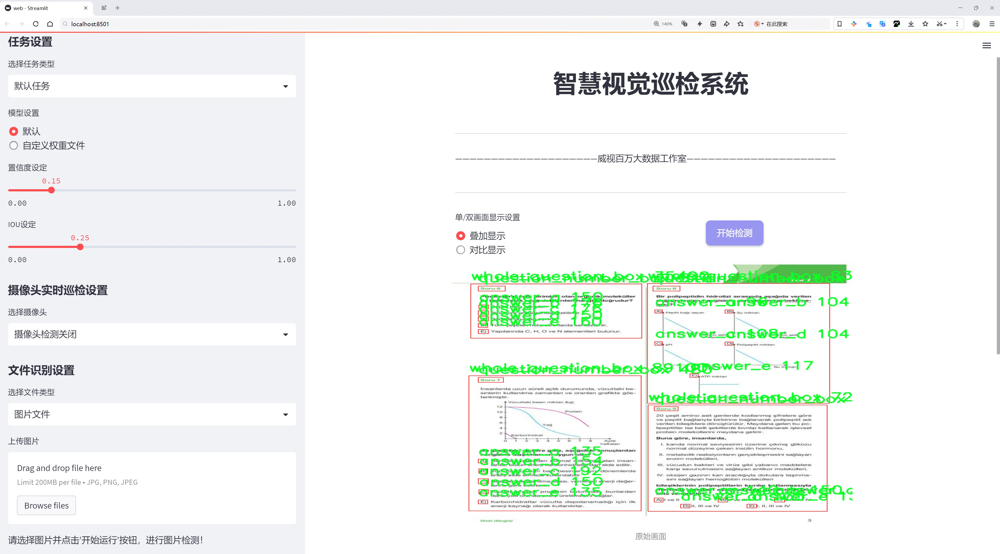
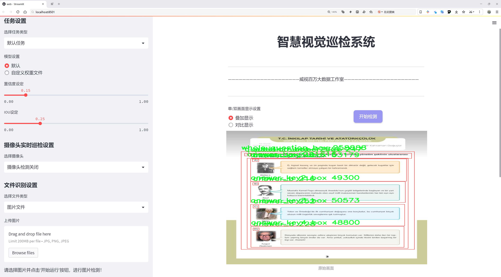
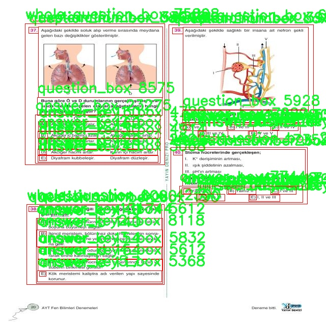
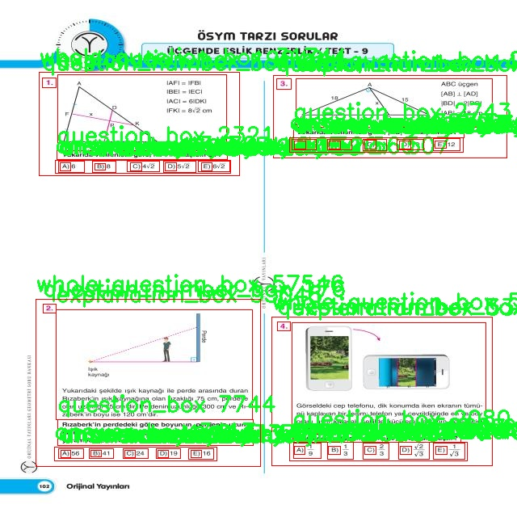
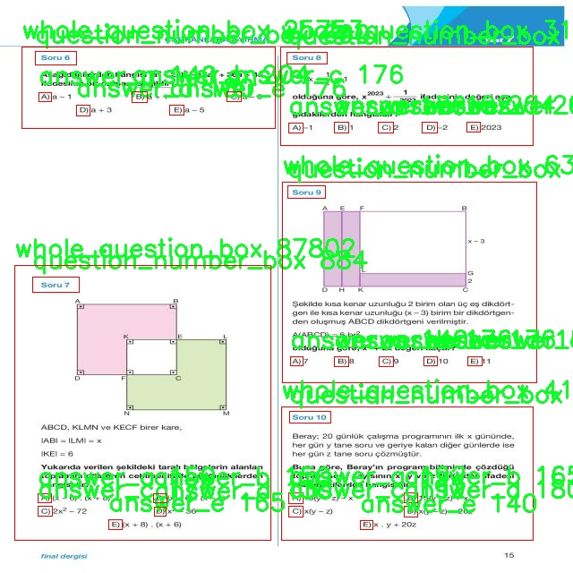
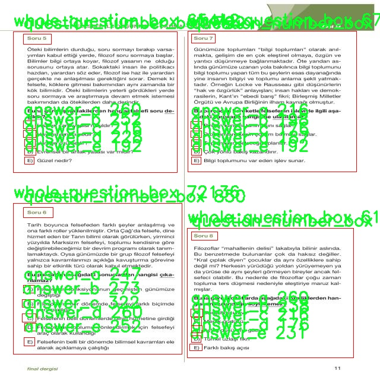
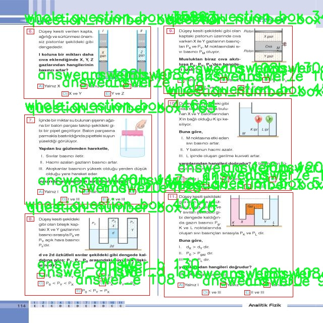

# 问答系统布局定位检测系统源码分享
 # [一条龙教学YOLOV8标注好的数据集一键训练_70+全套改进创新点发刊_Web前端展示]

### 1.研究背景与意义

项目参考[AAAI Association for the Advancement of Artificial Intelligence](https://gitee.com/qunshansj/projects)

项目来源[AACV Association for the Advancement of Computer Vision](https://gitee.com/qunmasj/projects)

研究背景与意义

在信息爆炸的时代，如何高效地获取和处理信息成为了一个重要的研究课题。问答系统作为人工智能领域的一项重要应用，旨在通过自然语言处理技术，帮助用户快速找到所需的信息。然而，传统的问答系统往往依赖于文本匹配和语义理解，难以在复杂的场景中实现准确的布局定位，尤其是在涉及多种信息类别的情况下。因此，基于改进YOLOv8的问答系统布局定位系统的研究具有重要的现实意义和学术价值。

YOLO（You Only Look Once）系列模型以其高效的目标检测能力而广受欢迎，尤其是在实时处理和多目标检测方面表现优异。YOLOv8作为该系列的最新版本，进一步提升了检测精度和速度，适用于多种应用场景。通过对YOLOv8模型的改进，可以有效提升问答系统在复杂布局中的信息提取能力，尤其是在涉及多个答案框、问题框和解释框的情况下。这种改进不仅可以提高系统的响应速度，还能增强用户体验，使用户能够更直观地获取信息。

在本研究中，我们将使用一个包含1700张图像和17个类别的数据集，该数据集涵盖了多种信息类型，包括问题框、答案框和解释框等。这些类别的多样性为系统的布局定位提供了丰富的训练样本，使得模型能够学习到不同信息之间的空间关系和结构特征。通过对这些类别的深入分析和处理，我们可以构建一个更为智能的问答系统，能够在复杂的视觉环境中自动识别和定位相关信息，从而提高问答的准确性和效率。

此外，随着深度学习技术的不断发展，模型的可解释性和透明性逐渐成为研究的热点。改进YOLOv8的问答系统布局定位不仅可以提升模型的性能，还可以通过可视化技术帮助用户理解模型的决策过程。这种可解释性将为用户提供更高的信任度，促进人工智能技术在实际应用中的推广。

综上所述，基于改进YOLOv8的问答系统布局定位系统的研究，不仅能够提升问答系统在复杂场景中的信息提取能力，还能够为深度学习模型的可解释性提供新的思路。这项研究将为未来的智能问答系统发展奠定基础，推动人工智能技术在教育、医疗、金融等多个领域的应用，具有广泛的社会价值和深远的学术意义。通过对该领域的深入探索，我们期望能够为用户提供更加智能、便捷的信息获取方式，助力信息时代的知识传播与共享。

### 2.图片演示







##### 注意：由于此博客编辑较早，上面“2.图片演示”和“3.视频演示”展示的系统图片或者视频可能为老版本，新版本在老版本的基础上升级如下：（实际效果以升级的新版本为准）

  （1）适配了YOLOV8的“目标检测”模型和“实例分割”模型，通过加载相应的权重（.pt）文件即可自适应加载模型。

  （2）支持“图片识别”、“视频识别”、“摄像头实时识别”三种识别模式。

  （3）支持“图片识别”、“视频识别”、“摄像头实时识别”三种识别结果保存导出，解决手动导出（容易卡顿出现爆内存）存在的问题，识别完自动保存结果并导出到tempDir中。

  （4）支持Web前端系统中的标题、背景图等自定义修改，后面提供修改教程。

  另外本项目提供训练的数据集和训练教程,暂不提供权重文件（best.pt）,需要您按照教程进行训练后实现图片演示和Web前端界面演示的效果。

### 3.视频演示

[3.1 视频演示](https://www.bilibili.com/video/BV11F4Se3EJZ/)

### 4.数据集信息展示

##### 4.1 本项目数据集详细数据（类别数＆类别名）

nc: 16
names: ['answer_a', 'answer_b', 'answer_box', 'answer_c', 'answer_d', 'answer_e', 'answer_key1_box', 'answer_key2_box', 'answer_key3_box', 'answer_key4_box', 'answer_key5_box', 'explanation_box', 'question_box', 'question_kok', 'question_number_box', 'whole_question_box']


##### 4.2 本项目数据集信息介绍

数据集信息展示

在本研究中，我们采用了名为“eraymerge”的数据集，以改进YOLOv8的问答系统布局定位能力。该数据集的设计旨在为复杂的问答场景提供全面的支持，特别是在信息提取和结构化数据处理方面。通过对该数据集的深入分析，我们能够有效地训练和优化模型，以提高其在实际应用中的表现。

“eraymerge”数据集包含16个类别，涵盖了问答系统中各个关键组成部分。这些类别包括：‘answer_a’、‘answer_b’、‘answer_box’、‘answer_c’、‘answer_d’、‘answer_e’、‘answer_key1_box’、‘answer_key2_box’、‘answer_key3_box’、‘answer_key4_box’、‘answer_key5_box’、‘explanation_box’、‘question_box’、‘question_kok’、‘question_number_box’和‘whole_question_box’。每个类别都对应着问答系统中不同的功能模块，确保了数据集的多样性和全面性。

首先，‘answer_a’至‘answer_e’这五个类别代表了问答系统中可能的多种答案选项。它们的存在使得模型能够学习如何从给定的问题中提取出正确的答案，并在多选项中进行有效的区分。这对于提升系统的准确性至关重要，尤其是在复杂的问答场景中，用户往往需要从多个选项中选择一个最合适的答案。

其次，‘answer_box’和各个‘answer_keyX_box’类别则用于标识答案的框架和位置。这些框不仅提供了答案的视觉定位信息，还帮助模型理解答案在整体布局中的关系。这种空间信息的引入，使得模型能够更好地理解问答系统的结构，进而提高其对问题和答案之间关系的理解能力。

‘explanation_box’类别则是一个重要的补充，它提供了对答案的详细解释。通过学习这一类别，模型不仅能够给出答案，还能够理解答案背后的逻辑和原因，这对于用户在复杂问题上的理解和学习尤为重要。

在问答系统中，问题的表示同样至关重要。‘question_box’、‘question_kok’、‘question_number_box’和‘whole_question_box’这几个类别分别对应了问题的不同表示形式。通过这些类别，模型能够学习到如何从不同的角度和形式来解析问题，从而提高其对问题的理解能力。这种多样化的训练方式使得模型在面对各种问题时，能够更加灵活和准确地进行响应。

总的来说，“eraymerge”数据集通过其丰富的类别设置和多样化的样本，提供了一个理想的训练基础，旨在提升YOLOv8在问答系统布局定位方面的性能。通过对这些类别的深入学习，模型不仅能够在视觉上识别和定位问答系统中的各个组成部分，还能够在语义上理解问题与答案之间的复杂关系。这种结合将为未来的问答系统提供更为强大的支持，推动智能问答技术的进一步发展。











### 5.全套项目环境部署视频教程（零基础手把手教学）

[5.1 环境部署教程链接（零基础手把手教学）](https://www.ixigua.com/7404473917358506534?logTag=c807d0cbc21c0ef59de5)


[5.2 安装Python虚拟环境创建和依赖库安装视频教程链接（零基础手把手教学）](https://www.ixigua.com/7404474678003106304?logTag=1f1041108cd1f708b01a)

### 6.手把手YOLOV8训练视频教程（零基础小白有手就能学会）

[6.1 手把手YOLOV8训练视频教程（零基础小白有手就能学会）](https://www.ixigua.com/7404477157818401292?logTag=d31a2dfd1983c9668658)

### 7.70+种全套YOLOV8创新点代码加载调参视频教程（一键加载写好的改进模型的配置文件）

[7.1 70+种全套YOLOV8创新点代码加载调参视频教程（一键加载写好的改进模型的配置文件）](https://www.ixigua.com/7404478314661806627?logTag=29066f8288e3f4eea3a4)

### 8.70+种全套YOLOV8创新点原理讲解（非科班也可以轻松写刊发刊，V10版本正在科研待更新）

由于篇幅限制，每个创新点的具体原理讲解就不一一展开，具体见下列网址中的创新点对应子项目的技术原理博客网址【Blog】：


[8.1 70+种全套YOLOV8创新点原理讲解链接](https://gitee.com/qunmasj/good)

### 9.系统功能展示（检测对象为举例，实际内容以本项目数据集为准）

图9.1.系统支持检测结果表格显示

  图9.2.系统支持置信度和IOU阈值手动调节

  图9.3.系统支持自定义加载权重文件best.pt(需要你通过步骤5中训练获得)

  图9.4.系统支持摄像头实时识别

  图9.5.系统支持图片识别

  图9.6.系统支持视频识别

  图9.7.系统支持识别结果文件自动保存

  图9.8.系统支持Excel导出检测结果数据


### 10.原始YOLOV8算法原理

原始YOLOv8算法原理

YOLOv8作为YOLO系列中的最新版本，代表了目标检测领域的一次重要技术革新。自2015年YOLO模型首次提出以来，经过多个版本的迭代，YOLOv8在速度、精度、易用性和硬件支持等方面均表现出色，成为业界广泛应用的模型之一。YOLOv8的设计理念是快速、准确且易于使用，这使得它在目标检测、图像分割和图像分类等任务中表现优异。

YOLOv8的网络结构主要由三部分组成：Backbone、Neck和Head。Backbone负责特征提取，Neck实现特征融合，而Head则用于输出检测信息。具体而言，Backbone部分采用了CSPDarknet结构，利用多个残差块进行特征提取。相较于前代模型，YOLOv8在Backbone中引入了C2F模块，替代了YOLOv5中的C3模块。C2F模块通过将输入特征图分为两个分支，分别经过卷积层进行降维，能够有效提升模型的梯度流信息，从而提高特征提取的精度和效率。

在Neck部分，YOLOv8的设计也有所改进。与YOLOv5相比，YOLOv8去除了多余的1x1卷积连接层，直接对Backbone不同阶段输出的特征进行上采样。这种简化不仅减少了计算复杂度，还提升了特征融合的效率，使得模型在处理不同尺度的目标时更加灵活。

YOLOv8的Head部分是其最大的创新之一。传统的YOLO模型使用耦合头（Coupled-Head）结构，检测和分类共用一个卷积层。而YOLOv8则采用了解耦头（Decoupled-Head）结构，将检测和分类的卷积分开，分别进行处理。这种设计使得模型在进行目标检测时能够更好地聚焦于不同任务的特征，从而提高检测精度。此外，YOLOv8在损失函数的设计上也进行了优化，取消了对象分支，改为在分类分支中使用二值交叉熵损失（BCELoss），而在边界框回归分支中则采用了分布焦点损失（DFL）和CIoU损失。这种损失函数的组合使得模型能够更快地聚焦于标签附近的区域，提高了目标检测的准确性。

另一个显著的变化是YOLOv8放弃了传统的基于锚框（Anchor-Based）的方法，转而采用无锚框（Anchor-Free）的方法。传统的锚框方法需要预设目标可能存在的位置和大小，增加了计算复杂度，并且在处理不同尺度和形状的目标时缺乏灵活性。而YOLOv8通过将目标检测转化为关键点检测，避免了对锚框的依赖，使得模型的结构更加简洁，泛化能力更强。

在输入处理方面，YOLOv8也引入了自适应图像缩放技术。默认情况下，YOLOv8的输入图像尺寸为640x640，但在实际应用中，图像的长宽比往往各不相同。为了解决这一问题，YOLOv8在测试和推理时采用自适应缩放，将长边按比例缩小到指定尺寸，然后对短边进行填充。这种方法有效减少了信息冗余，提高了目标检测的速度和准确性。此外，YOLOv8在训练过程中使用了Mosaic图像增强技术，通过随机拼接多张图像来生成新的训练样本，进一步提升了模型的学习能力和鲁棒性。

总的来说，YOLOv8在设计上充分考虑了目标检测任务的复杂性，通过引入新的模块和优化现有结构，使得模型在精度和速度上都有了显著提升。其解耦头结构、无锚框检测方法以及自适应图像处理等创新，使得YOLOv8在处理各种目标检测任务时，能够更好地适应不同场景和数据集的需求。随着YOLOv8的广泛应用，预计将进一步推动目标检测技术的发展，为各类智能应用提供强有力的支持。


### 11.项目核心源码讲解（再也不用担心看不懂代码逻辑）

#### 11.1 70+种YOLOv8算法改进源码大全和调试加载训练教程（非必要）\ultralytics\nn\extra_modules\ops_dcnv3\functions\dcnv3_func.py

以下是经过简化和注释的核心代码，保留了主要功能和结构，便于理解和使用。

```python
# --------------------------------------------------------
# InternImage
# Copyright (c) 2022 OpenGVLab
# Licensed under The MIT License [see LICENSE for details]
# --------------------------------------------------------

import torch
import torch.nn.functional as F
from torch.autograd import Function
from torch.cuda.amp import custom_bwd, custom_fwd

class DCNv3Function(Function):
    @staticmethod
    @custom_fwd
    def forward(ctx, input, offset, mask, kernel_h, kernel_w, stride_h, stride_w, pad_h, pad_w, dilation_h, dilation_w, group, group_channels, offset_scale, im2col_step, remove_center):
        # 保存卷积参数到上下文中
        ctx.kernel_h = kernel_h
        ctx.kernel_w = kernel_w
        ctx.stride_h = stride_h
        ctx.stride_w = stride_w
        ctx.pad_h = pad_h
        ctx.pad_w = pad_w
        ctx.dilation_h = dilation_h
        ctx.dilation_w = dilation_w
        ctx.group = group
        ctx.group_channels = group_channels
        ctx.offset_scale = offset_scale
        ctx.im2col_step = im2col_step
        ctx.remove_center = remove_center

        # 调用DCNv3的前向函数
        output = DCNv3.dcnv3_forward(input, offset, mask, kernel_h, kernel_w, stride_h, stride_w, pad_h, pad_w, dilation_h, dilation_w, group, group_channels, offset_scale, ctx.im2col_step)
        ctx.save_for_backward(input, offset, mask)  # 保存输入以便反向传播使用

        return output

    @staticmethod
    @custom_bwd
    def backward(ctx, grad_output):
        # 从上下文中恢复输入
        input, offset, mask = ctx.saved_tensors

        # 调用DCNv3的反向函数
        grad_input, grad_offset, grad_mask = DCNv3.dcnv3_backward(input, offset, mask, ctx.kernel_h, ctx.kernel_w, ctx.stride_h, ctx.stride_w, ctx.pad_h, ctx.pad_w, ctx.dilation_h, ctx.dilation_w, ctx.group, ctx.group_channels, ctx.offset_scale, grad_output.contiguous(), ctx.im2col_step)

        return grad_input, grad_offset, grad_mask, None, None, None, None, None, None, None, None, None, None, None, None, None

def dcnv3_core_pytorch(input, offset, mask, kernel_h, kernel_w, stride_h, stride_w, pad_h, pad_w, dilation_h, dilation_w, group, group_channels, offset_scale, remove_center):
    # 对输入进行填充
    input = F.pad(input, [0, 0, pad_h, pad_h, pad_w, pad_w])
    N_, H_in, W_in, _ = input.shape
    _, H_out, W_out, _ = offset.shape

    # 计算参考点和采样网格
    ref = _get_reference_points(input.shape, input.device, kernel_h, kernel_w, dilation_h, dilation_w, pad_h, pad_w, stride_h, stride_w)
    grid = _generate_dilation_grids(input.shape, kernel_h, kernel_w, dilation_h, dilation_w, group, input.device)

    # 计算采样位置
    sampling_locations = (ref + grid * offset_scale).repeat(N_, 1, 1, 1, 1)
    if remove_center:
        sampling_locations = remove_center_sampling_locations(sampling_locations, kernel_w=kernel_w, kernel_h=kernel_h)
    sampling_locations = sampling_locations.flatten(3, 4) + offset * offset_scale

    # 进行双线性插值采样
    input_ = input.view(N_, H_in * W_in, group * group_channels).transpose(1, 2).reshape(N_ * group, group_channels, H_in, W_in)
    sampling_grid_ = (2 * sampling_locations - 1).view(N_, H_out * W_out, group, -1, 2).transpose(1, 2).flatten(0, 1)
    sampling_input_ = F.grid_sample(input_, sampling_grid_, mode='bilinear', padding_mode='zeros', align_corners=False)

    # 计算输出
    mask = mask.view(N_, H_out * W_out, group, -1).transpose(1, 2).reshape(N_ * group, 1, H_out * W_out, -1)
    output = (sampling_input_ * mask).sum(-1).view(N_, group * group_channels, H_out * W_out)

    return output.transpose(1, 2).reshape(N_, H_out, W_out, -1).contiguous()
```

### 代码注释说明：
1. **DCNv3Function**: 这是一个自定义的PyTorch函数，封装了DCNv3的前向和反向传播逻辑。
   - `forward`方法用于计算前向传播，保存必要的参数和输入。
   - `backward`方法用于计算反向传播，使用保存的输入和梯度计算输入的梯度。

2. **dcnv3_core_pytorch**: 该函数实现了DCNv3的核心逻辑，包括输入填充、参考点计算、采样位置生成和双线性插值。
   - 使用`F.pad`对输入进行填充以适应卷积操作。
   - 计算参考点和采样网格，以便进行空间变换。
   - 通过`F.grid_sample`进行双线性插值，得到最终输出。

3. **辅助函数**: `_get_reference_points`、`_generate_dilation_grids`、`remove_center_sampling_locations`等函数用于生成参考点、采样网格和处理中心采样位置。

以上代码保留了核心功能，并通过注释解释了每个部分的作用，便于理解和使用。

这个文件是一个实现了DCNv3（Deformable Convolutional Networks v3）功能的PyTorch自定义操作的代码。DCNv3是一种可变形卷积，能够根据输入特征图的内容动态调整卷积核的位置，从而提高模型对物体形状和位置变化的适应能力。

首先，文件导入了一些必要的库，包括PyTorch及其功能模块，定义了一个DCNv3Function类，继承自PyTorch的Function类。这个类实现了DCNv3的前向传播和反向传播逻辑。

在前向传播方法中，首先将输入参数保存到上下文（ctx）中，以便在反向传播时使用。接着，调用了DCNv3的C++实现中的前向函数，传入必要的参数并计算输出。前向传播的结果是经过可变形卷积处理后的特征图。

反向传播方法则负责计算梯度。它从上下文中恢复输入张量，并构建相应的参数，然后调用DCNv3的C++实现中的反向函数来计算输入、偏移量和掩码的梯度。

在符号函数中，定义了DCNv3在ONNX模型导出时的符号表示，确保模型能够在不同的框架中进行迁移。

文件中还定义了一些辅助函数，包括获取参考点、生成膨胀网格、移除中心采样位置等。这些函数用于在可变形卷积过程中计算采样位置和处理输入数据。

dcnv3_core_pytorch函数是DCNv3的核心实现，负责执行可变形卷积的具体操作。它首先对输入进行填充，然后计算参考点和膨胀网格。接着，根据偏移量和掩码进行采样，最后将结果整合并返回。

总的来说，这个文件实现了DCNv3的关键功能，通过自定义的前向和反向传播方法，使得可变形卷积能够在PyTorch中高效运行。

#### 11.2 ui.py

以下是代码中最核心的部分，并附上详细的中文注释：

```python
import sys
import subprocess

def run_script(script_path):
    """
    使用当前 Python 环境运行指定的脚本。

    Args:
        script_path (str): 要运行的脚本路径

    Returns:
        None
    """
    # 获取当前 Python 解释器的路径
    python_path = sys.executable

    # 构建运行命令，使用 streamlit 运行指定的脚本
    command = f'"{python_path}" -m streamlit run "{script_path}"'

    # 执行命令
    result = subprocess.run(command, shell=True)
    # 检查命令执行的返回码，如果不为0，表示执行出错
    if result.returncode != 0:
        print("脚本运行出错。")


# 实例化并运行应用
if __name__ == "__main__":
    # 指定要运行的脚本路径
    script_path = "web.py"  # 这里可以直接指定脚本名称，假设在当前目录下

    # 调用函数运行脚本
    run_script(script_path)
```

### 代码注释说明：
1. **导入模块**：
   - `sys`：用于访问与 Python 解释器相关的变量和函数。
   - `subprocess`：用于创建新进程、连接到它们的输入/输出/错误管道，并获取它们的返回码。

2. **定义 `run_script` 函数**：
   - 该函数接受一个参数 `script_path`，表示要运行的 Python 脚本的路径。
   - 使用 `sys.executable` 获取当前 Python 解释器的路径，以确保使用正确的 Python 环境来运行脚本。
   - 构建一个命令字符串，使用 `streamlit` 模块运行指定的脚本。
   - 使用 `subprocess.run` 执行构建的命令，并检查返回码以确定脚本是否成功运行。

3. **主程序入口**：
   - 在 `if __name__ == "__main__":` 块中，指定要运行的脚本路径（在此示例中为 `web.py`）。
   - 调用 `run_script` 函数，传入脚本路径以执行该脚本。

这个程序文件名为 `ui.py`，其主要功能是使用当前的 Python 环境来运行一个指定的脚本，具体是一个名为 `web.py` 的文件。程序首先导入了必要的模块，包括 `sys`、`os` 和 `subprocess`，以及一个自定义的路径处理模块 `abs_path`。

在 `run_script` 函数中，程序接收一个参数 `script_path`，表示要运行的脚本的路径。函数内部首先获取当前 Python 解释器的路径，这通过 `sys.executable` 实现。接着，程序构建一个命令字符串，该命令使用 `streamlit` 模块来运行指定的脚本。这里的命令格式为 `"{python_path}" -m streamlit run "{script_path}"`，其中 `python_path` 是当前 Python 解释器的路径，`script_path` 是要运行的脚本路径。

随后，程序使用 `subprocess.run` 方法来执行构建好的命令。这个方法会在一个新的 shell 中运行命令，并等待其完成。如果命令执行后返回的状态码不为零，表示脚本运行出错，程序会输出一条错误信息。

在文件的最后部分，程序通过 `if __name__ == "__main__":` 语句来判断是否直接运行该脚本。如果是，则指定要运行的脚本路径为 `web.py`，并调用 `run_script` 函数来执行该脚本。值得注意的是，`abs_path` 函数用于获取 `web.py` 的绝对路径，以确保脚本能够正确找到并运行。

总体来说，这个程序的核心功能是提供一个简单的接口来运行 Streamlit 应用，方便用户在当前 Python 环境中启动一个 Web 应用。

#### 11.3 code\ultralytics\models\yolo\classify\__init__.py

```python
# 导入Ultralytics YOLO库中的分类模型相关模块
# Ultralytics YOLO 🚀, AGPL-3.0 许可证

# 从ultralytics.models.yolo.classify.predict模块导入分类预测器
from ultralytics.models.yolo.classify.predict import ClassificationPredictor

# 从ultralytics.models.yolo.classify.train模块导入分类训练器
from ultralytics.models.yolo.classify.train import ClassificationTrainer

# 从ultralytics.models.yolo.classify.val模块导入分类验证器
from ultralytics.models.yolo.classify.val import ClassificationValidator

# 定义模块的公开接口，允许外部访问这些类
__all__ = "ClassificationPredictor", "ClassificationTrainer", "ClassificationValidator"
```

### 代码核心部分说明：
1. **模块导入**：
   - 代码从`ultralytics.models.yolo.classify`子模块中导入了三个核心类：`ClassificationPredictor`、`ClassificationTrainer`和`ClassificationValidator`。这些类分别用于分类任务的预测、训练和验证。

2. **公开接口**：
   - `__all__`变量定义了模块的公开接口，表明当使用`from module import *`时，哪些类会被导入。这里列出了三个核心类，确保它们可以被外部访问。

这个程序文件是Ultralytics YOLO模型中的一个初始化文件，位于`code/ultralytics/models/yolo/classify/`目录下。文件的主要功能是导入与分类相关的模块，并定义了该模块的公共接口。

首先，文件开头的注释部分表明这是Ultralytics YOLO项目的一部分，并且遵循AGPL-3.0许可证。这说明该项目是开源的，用户可以自由使用和修改，但需要遵循相应的许可证条款。

接下来，文件通过`from`语句导入了三个重要的类：`ClassificationPredictor`、`ClassificationTrainer`和`ClassificationValidator`。这些类分别用于分类任务中的预测、训练和验证。具体来说：

- `ClassificationPredictor`类负责对输入数据进行分类预测，通常用于模型的推理阶段。
- `ClassificationTrainer`类用于训练分类模型，包含了训练过程中所需的各种方法和参数设置。
- `ClassificationValidator`类则用于验证训练好的模型的性能，通常在训练完成后进行，以评估模型在验证集上的表现。

最后，`__all__`变量定义了该模块的公共接口，指定了在使用`from module import *`语句时可以导入的类。这意味着当其他模块或用户导入这个模块时，只能访问`ClassificationPredictor`、`ClassificationTrainer`和`ClassificationValidator`这三个类，而不能访问模块内部的其他内容。

总的来说，这个初始化文件的作用是将分类相关的功能模块整合在一起，方便其他部分的代码进行调用和使用。

#### 11.4 70+种YOLOv8算法改进源码大全和调试加载训练教程（非必要）\ultralytics\engine\__init__.py

以下是代码的核心部分，并附上详细的中文注释：

```python
# Ultralytics YOLO 🚀, AGPL-3.0 license

# 该行代码是一个注释，表明这是Ultralytics开发的YOLO（You Only Look Once）模型的代码。
# YOLO是一种用于目标检测的深度学习模型，具有快速和高效的特点。
# AGPL-3.0是该代码的许可证，表示代码的使用和分发需要遵循该许可证的条款。
```

由于原始代码仅包含一行注释，以上是对该行代码的核心内容和详细解释。

这个程序文件的开头包含了一行注释，说明了该文件属于Ultralytics YOLO项目，并且使用的是AGPL-3.0许可证。Ultralytics YOLO是一个流行的目标检测算法，YOLO（You Only Look Once）系列在计算机视觉领域中广泛应用，尤其是在实时目标检测任务中。

这行注释的作用主要是提供项目的版权信息和许可证类型，AGPL-3.0许可证是一种开源许可证，允许用户自由使用、修改和分发软件，但要求在分发时必须公开源代码。这意味着任何基于此代码的修改或扩展也必须遵循相同的许可证条款，从而促进开源社区的合作与发展。

虽然该文件的内容非常简短，但它的存在是为了标识代码的来源和使用条款，确保用户在使用该代码时遵循相关的法律和道德规范。

#### 11.5 train.py

以下是经过简化和注释的核心代码部分：

```python
import random
import numpy as np
import torch.nn as nn
from ultralytics.data import build_dataloader, build_yolo_dataset
from ultralytics.engine.trainer import BaseTrainer
from ultralytics.models import yolo
from ultralytics.nn.tasks import DetectionModel
from ultralytics.utils import LOGGER, RANK
from ultralytics.utils.torch_utils import de_parallel, torch_distributed_zero_first

class DetectionTrainer(BaseTrainer):
    """
    基于检测模型的训练类，继承自BaseTrainer类。
    """

    def build_dataset(self, img_path, mode="train", batch=None):
        """
        构建YOLO数据集。

        参数:
            img_path (str): 包含图像的文件夹路径。
            mode (str): 模式，'train'或'val'，用户可以为每种模式自定义不同的增强。
            batch (int, optional): 批次大小，仅用于'rect'模式。默认为None。
        """
        gs = max(int(de_parallel(self.model).stride.max() if self.model else 0), 32)
        return build_yolo_dataset(self.args, img_path, batch, self.data, mode=mode, rect=mode == "val", stride=gs)

    def get_dataloader(self, dataset_path, batch_size=16, rank=0, mode="train"):
        """构造并返回数据加载器。"""
        assert mode in ["train", "val"]
        with torch_distributed_zero_first(rank):  # 仅在DDP中初始化数据集*.cache一次
            dataset = self.build_dataset(dataset_path, mode, batch_size)
        shuffle = mode == "train"  # 训练模式下打乱数据
        workers = self.args.workers if mode == "train" else self.args.workers * 2
        return build_dataloader(dataset, batch_size, workers, shuffle, rank)  # 返回数据加载器

    def preprocess_batch(self, batch):
        """对一批图像进行预处理，包括缩放和转换为浮点数。"""
        batch["img"] = batch["img"].to(self.device, non_blocking=True).float() / 255  # 将图像归一化到[0, 1]
        if self.args.multi_scale:  # 如果启用多尺度
            imgs = batch["img"]
            sz = (
                random.randrange(self.args.imgsz * 0.5, self.args.imgsz * 1.5 + self.stride)
                // self.stride
                * self.stride
            )  # 随机选择新的尺寸
            sf = sz / max(imgs.shape[2:])  # 计算缩放因子
            if sf != 1:
                ns = [
                    math.ceil(x * sf / self.stride) * self.stride for x in imgs.shape[2:]
                ]  # 计算新的形状
                imgs = nn.functional.interpolate(imgs, size=ns, mode="bilinear", align_corners=False)  # 调整图像大小
            batch["img"] = imgs
        return batch

    def set_model_attributes(self):
        """设置模型的属性，包括类别数量和名称。"""
        self.model.nc = self.data["nc"]  # 将类别数量附加到模型
        self.model.names = self.data["names"]  # 将类别名称附加到模型
        self.model.args = self.args  # 将超参数附加到模型

    def get_model(self, cfg=None, weights=None, verbose=True):
        """返回YOLO检测模型。"""
        model = DetectionModel(cfg, nc=self.data["nc"], verbose=verbose and RANK == -1)
        if weights:
            model.load(weights)  # 加载权重
        return model

    def plot_training_samples(self, batch, ni):
        """绘制带有注释的训练样本。"""
        plot_images(
            images=batch["img"],
            batch_idx=batch["batch_idx"],
            cls=batch["cls"].squeeze(-1),
            bboxes=batch["bboxes"],
            paths=batch["im_file"],
            fname=self.save_dir / f"train_batch{ni}.jpg",
            on_plot=self.on_plot,
        )
```

### 代码注释说明：
1. **类定义**：`DetectionTrainer`类用于实现YOLO模型的训练，继承自`BaseTrainer`。
2. **构建数据集**：`build_dataset`方法用于构建YOLO数据集，支持训练和验证模式。
3. **获取数据加载器**：`get_dataloader`方法用于创建数据加载器，支持多进程和数据打乱。
4. **预处理批次**：`preprocess_batch`方法对输入图像进行归一化和缩放处理，以适应模型输入。
5. **设置模型属性**：`set_model_attributes`方法将类别数量和名称设置到模型中。
6. **获取模型**：`get_model`方法返回一个YOLO检测模型，并可选择加载预训练权重。
7. **绘制训练样本**：`plot_training_samples`方法用于可视化训练样本及其对应的标签。

这个程序文件 `train.py` 是一个用于训练目标检测模型的脚本，主要基于 YOLO（You Only Look Once）架构。文件中定义了一个名为 `DetectionTrainer` 的类，该类继承自 `BaseTrainer`，用于实现目标检测模型的训练过程。

在这个类中，首先定义了 `build_dataset` 方法，该方法用于构建 YOLO 数据集。它接收图像路径、模式（训练或验证）和批次大小作为参数，并根据模型的步幅来确定数据集的构建方式。接着，`get_dataloader` 方法用于创建数据加载器，确保在分布式训练中只初始化一次数据集，并根据模式选择是否打乱数据。

`preprocess_batch` 方法负责对图像批次进行预处理，包括将图像缩放到适当的大小并转换为浮点数格式。该方法还支持多尺度训练，通过随机选择图像大小来增强模型的鲁棒性。

`set_model_attributes` 方法用于设置模型的属性，包括类别数量和类别名称等，以确保模型能够正确处理训练数据。`get_model` 方法则返回一个 YOLO 检测模型，并可以选择加载预训练权重。

`get_validator` 方法返回一个用于验证模型性能的验证器，`label_loss_items` 方法用于生成带有标签的损失字典，以便于监控训练过程中的损失情况。

此外，`progress_string` 方法用于格式化输出训练进度的信息，包括当前的轮次、GPU 内存使用情况、损失值、实例数量和图像大小等。`plot_training_samples` 方法用于绘制训练样本及其标注，便于可视化训练数据的质量。

最后，`plot_metrics` 和 `plot_training_labels` 方法分别用于绘制训练过程中的指标和创建带标签的训练图，帮助用户更好地理解模型的训练效果。

整体而言，这个文件提供了一个完整的框架，用于训练 YOLO 目标检测模型，包括数据处理、模型构建、训练监控和结果可视化等功能。

#### 11.6 code\ultralytics\data\explorer\gui\dash.py

以下是经过简化并注释的核心代码部分：

```python
# 导入必要的库
import time
from threading import Thread
import pandas as pd
import streamlit as st
from ultralytics import Explorer
from ultralytics.utils import ROOT, SETTINGS
from ultralytics.utils.checks import check_requirements

# 检查所需的库是否已安装
check_requirements(("streamlit>=1.29.0", "streamlit-select>=0.2"))

def _get_explorer():
    """初始化并返回Explorer类的实例，创建嵌入表并跟踪进度。"""
    # 创建Explorer实例，使用当前会话状态中的数据集和模型
    exp = Explorer(data=st.session_state.get("dataset"), model=st.session_state.get("model"))
    
    # 启动一个线程来创建嵌入表
    thread = Thread(
        target=exp.create_embeddings_table, kwargs={"force": st.session_state.get("force_recreate_embeddings")}
    )
    thread.start()  # 启动线程
    
    # 创建进度条并更新进度
    progress_bar = st.progress(0, text="Creating embeddings table...")
    while exp.progress < 1:  # 当进度小于1时持续更新
        time.sleep(0.1)  # 每0.1秒检查一次进度
        progress_bar.progress(exp.progress, text=f"Progress: {exp.progress * 100}%")  # 更新进度条
    thread.join()  # 等待线程完成
    st.session_state["explorer"] = exp  # 将Explorer实例存储在会话状态中
    progress_bar.empty()  # 清空进度条

def init_explorer_form():
    """初始化Explorer实例并创建嵌入表，带有进度跟踪的表单。"""
    # 获取数据集和模型列表
    datasets = ROOT / "cfg" / "datasets"
    ds = [d.name for d in datasets.glob("*.yaml")]
    models = ["yolov8n.pt", "yolov8s.pt", "yolov8m.pt", "yolov8l.pt", "yolov8x.pt"]  # 模型列表

    # 创建表单以选择数据集和模型
    with st.form(key="explorer_init_form"):
        col1, col2 = st.columns(2)
        with col1:
            st.selectbox("Select dataset", ds, key="dataset", index=ds.index("coco128.yaml"))  # 选择数据集
        with col2:
            st.selectbox("Select model", models, key="model")  # 选择模型
        st.checkbox("Force recreate embeddings", key="force_recreate_embeddings")  # 复选框

        # 提交按钮，点击后调用_get_explorer函数
        st.form_submit_button("Explore", on_click=_get_explorer)

def run_sql_query():
    """执行SQL查询并返回结果。"""
    st.session_state["error"] = None  # 清除错误信息
    query = st.session_state.get("query")  # 获取查询字符串
    if query.strip():  # 如果查询字符串不为空
        exp = st.session_state["explorer"]  # 获取Explorer实例
        res = exp.sql_query(query, return_type="arrow")  # 执行SQL查询
        st.session_state["imgs"] = res.to_pydict()["im_file"]  # 将结果存储在会话状态中

def layout():
    """设置页面布局，提供文档链接和API文档。"""
    st.set_page_config(layout="wide", initial_sidebar_state="collapsed")  # 设置页面配置
    st.markdown("<h1 style='text-align: center;'>Ultralytics Explorer Demo</h1>", unsafe_allow_html=True)

    if st.session_state.get("explorer") is None:  # 如果Explorer实例为空，初始化表单
        init_explorer_form()
        return

    exp = st.session_state.get("explorer")  # 获取Explorer实例
    # 其他布局和功能代码省略...

if __name__ == "__main__":
    layout()  # 运行布局函数
```

### 代码说明：
1. **导入库**：导入了所需的库，包括`streamlit`用于构建Web应用，`pandas`用于数据处理，以及`ultralytics`库中的`Explorer`类。
2. **检查依赖**：使用`check_requirements`函数确保所需的库已安装。
3. **`_get_explorer`函数**：初始化`Explorer`实例并在后台线程中创建嵌入表，同时更新进度条。
4. **`init_explorer_form`函数**：创建一个表单，允许用户选择数据集和模型，并在提交时调用`_get_explorer`。
5. **`run_sql_query`函数**：执行用户输入的SQL查询并将结果存储在会话状态中。
6. **`layout`函数**：设置页面布局，初始化Explorer表单，并处理用户交互。

这段代码的核心功能是提供一个用户界面，允许用户选择数据集和模型，并通过SQL查询与AI交互，最终展示结果。

这个程序文件是一个基于Streamlit框架的用户界面，旨在为Ultralytics YOLO模型提供数据探索功能。程序的主要功能是让用户选择数据集和模型，并通过可视化界面进行图像查询和相似图像搜索。

首先，程序导入了一些必要的库，包括时间处理、线程管理、数据处理（pandas）、Ultralytics的Explorer类以及Streamlit和streamlit_select库。它通过`check_requirements`函数确保所需的库版本已安装。

接下来，定义了一个名为`_get_explorer`的函数，该函数用于初始化Explorer实例，并在后台线程中创建嵌入表。通过进度条向用户显示创建过程的进度。创建完成后，将Explorer实例存储在会话状态中。

`init_explorer_form`函数用于初始化Explorer实例，允许用户选择数据集和模型。用户可以在表单中选择数据集（从配置文件中读取）和模型（提供了一系列YOLO模型的选项），并可以选择是否强制重新创建嵌入。

`query_form`和`ai_query_form`函数分别用于设置SQL查询和AI查询的输入表单。用户可以输入自定义查询，系统会根据输入执行相应的操作。

`find_similar_imgs`函数用于查找与选定图像相似的图像，并将结果存储在会话状态中。`similarity_form`函数则提供了一个表单，允许用户设置相似图像搜索的限制，并在选择了图像后执行搜索。

`run_sql_query`和`run_ai_query`函数分别用于执行SQL查询和AI查询，并将结果更新到会话状态中。如果没有找到结果，程序会提示用户。

`reset_explorer`函数用于重置Explorer的状态，清除会话中的相关变量。

`utralytics_explorer_docs_callback`函数提供了Ultralytics Explorer API的文档链接和相关信息，帮助用户了解如何使用该API。

最后，`layout`函数负责构建整个应用的布局，设置页面配置，并根据会话状态的不同显示不同的内容。如果没有初始化Explorer实例，则调用`init_explorer_form`函数；如果已初始化，则显示图像、查询表单和相似图像搜索表单。

程序的入口点在`if __name__ == "__main__":`部分，调用`layout`函数以启动应用。整体上，这个程序为用户提供了一个友好的界面来探索和查询图像数据，结合了YOLO模型的强大功能。

### 12.系统整体结构（节选）

### 整体功能和构架概括

该项目是一个基于YOLOv8的目标检测和分类框架，包含了多种算法改进、训练、推理和数据探索功能。项目的核心构架包括模型定义、训练过程、数据处理和用户界面等模块。具体来说，项目主要功能包括：

1. **模型定义**：实现YOLOv8及其变种的模型结构，支持目标检测和分类任务。
2. **训练与验证**：提供训练模型的功能，包括数据加载、损失计算、模型评估等。
3. **数据处理**：实现数据集的构建和预处理，支持多种数据格式和增强技术。
4. **用户界面**：通过Streamlit框架提供图形用户界面，方便用户进行数据探索、模型查询和相似图像搜索。
5. **可视化**：支持训练过程中的指标可视化和样本展示，帮助用户理解模型性能。

### 文件功能整理表

| 文件路径                                                                                              | 功能描述                                                                                          |
|-----------------------------------------------------------------------------------------------------|---------------------------------------------------------------------------------------------------|
| `70+种YOLOv8算法改进源码大全和调试加载训练教程（非必要）\ultralytics\nn\extra_modules\ops_dcnv3\functions\dcnv3_func.py` | 实现DCNv3（可变形卷积）的前向和反向传播功能，支持在PyTorch中高效运行可变形卷积操作。                      |
| `ui.py`                                                                                             | 提供一个简单的接口来运行Streamlit应用，方便用户在当前Python环境中启动Web应用。                      |
| `code\ultralytics\models\yolo\classify\__init__.py`                                               | 初始化分类模块，导入分类相关的类（如ClassificationPredictor、ClassificationTrainer等）。         |
| `70+种YOLOv8算法改进源码大全和调试加载训练教程（非必要）\ultralytics\engine\__init__.py`             | 初始化引擎模块，通常用于模型训练和推理的核心逻辑。                                               |
| `train.py`                                                                                          | 定义训练过程，包括数据集构建、模型训练、损失计算和训练监控等功能。                               |
| `code\ultralytics\data\explorer\gui\dash.py`                                                      | 使用Streamlit构建的用户界面，提供数据集选择、图像查询和相似图像搜索功能。                         |
| `code\ultralytics\hub\session.py`                                                                  | 管理模型会话和推理过程，通常用于处理模型的加载和执行。                                           |
| `code\model.py`                                                                                     | 定义模型的结构和相关功能，通常包括模型的初始化和前向传播逻辑。                                   |
| `70+种YOLOv8算法改进源码大全和调试加载训练教程（非必要）\ultralytics\nn\modules\block.py`          | 实现神经网络模块的基本构建块，可能包括卷积层、激活函数等的定义。                                  |
| `code\ultralytics\models\utils\__init__.py`                                                       | 初始化模型工具模块，提供模型相关的实用函数和类。                                                |
| `70+种YOLOv8算法改进源码大全和调试加载训练教程（非必要）\ultralytics\models\fastsam\model.py`     | 实现FastSAM模型的结构和功能，通常用于快速目标检测或分割任务。                                     |
| `code\ultralytics\models\utils\ops.py`                                                            | 定义模型操作的相关函数，可能包括一些自定义的层或操作。                                            |
| `70+种YOLOv8算法改进源码大全和调试加载训练教程（非必要）\ultralytics\utils\callbacks\dvc.py`      | 实现与DVC（数据版本控制）相关的回调函数，支持模型训练过程中的数据管理和版本控制。                |

以上表格整理了项目中各个文件的功能，帮助理解项目的整体结构和各个模块的作用。

注意：由于此博客编辑较早，上面“11.项目核心源码讲解（再也不用担心看不懂代码逻辑）”中部分代码可能会优化升级，仅供参考学习，完整“训练源码”、“Web前端界面”和“70+种创新点源码”以“13.完整训练+Web前端界面+70+种创新点源码、数据集获取”的内容为准。

### 13.完整训练+Web前端界面+70+种创新点源码、数据集获取


# [下载链接：https://mbd.pub/o/bread/ZpuVmppp](https://mbd.pub/o/bread/ZpuVmppp)